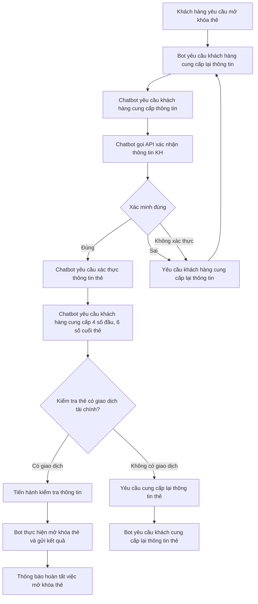

# 📌 TÀI LIỆU MÔ TẢ NGHIỆP VỤ & KỊCH BẢN POC
## POC tính năng cho phép admin thiết lập quy tắc kịch bản cho từng hành động – ví dụ “Mở khóa thẻ ghi nợ của khách hàng”

### 1. **Đặt vấn đề - Product Thinking**

**Problem:** Khách hàng gặp khó khăn khi không thể mở khóa thẻ ghi nợ do quên mã PIN hoặc do một số lỗi khác. Thay vì yêu cầu nhân viên hỗ trợ trực tiếp, chatbot có thể giải quyết vấn đề này thông qua quy trình tự động, tiết kiệm thời gian và nâng cao trải nghiệm khách hàng.

**Solution:** Xây dựng một hệ thống chatbot có khả năng nhận diện yêu cầu mở khóa thẻ, xác thực thông tin khách hàng, kiểm tra trạng thái thẻ và thực hiện yêu cầu mở khóa nếu thỏa mãn các điều kiện.

**Key Features:**
- Xác thực thông tin khách hàng (họ tên, số điện thoại, số CMND/CCCD).
- Xác thực thông tin thẻ (số thẻ, trạng thái thẻ, giao dịch gần nhất, dư nợ).
- Tính năng gọi API xác thực và trả kết quả.
- Quản lý quy trình tự động mở khóa thẻ với các điều kiện kiểm tra.

---

### 2. **Mục tiêu giải pháp - Product Discovery**

Cho phép người dùng nội bộ (ví dụ: nhân viên CSKH, quản trị hệ thống) có thể tạo và kiểm thử một kịch bản hành động dạng **rule-based** (dựa vào điều kiện) cho chatbot SHB, nhằm thực hiện thao tác “mở khóa thẻ” (trên tập dữ liệu dummy được cung cấp trong giai đoạn POC).

Đây là tính năng phục vụ cho khách hàng và nhân viên nội bộ của SHB trong việc xử lý các yêu cầu mở khóa thẻ ghi nợ khi bị khóa. Sản phẩm này sẽ cung cấp một quy trình tự động giúp xác thực thông tin của khách hàng và thẻ, từ đó tự động thực hiện mở khóa nếu tất cả các điều kiện thỏa mãn.

**Đối tượng sử dụng:**
- Nhân viên vận hành nội bộ SHB.
- Quản trị viên kiểm thử hệ thống POC.
- BA và Tester theo dõi hiệu quả thực hiện.

---

### 3. **Phạm vi kịch bản POC**

#### 3.1.Cấu trúc dữ liệu dummy gồm 2 bảng:

- **Database khách hàng:** Bao gồm các thông tin định danh như họ tên, số điện thoại, số CMND/CCCD, số tài khoản...
Đây là các thông tin cần lưu trữ về khách hàng, bao gồm tên, số điện thoại, số CMND/CCCD, và các thông tin khác liên quan đến việc xác minh khi khách hàng yêu cầu mở khóa thẻ:

| **Mã khách hàng** | **Họ và tên** | **Ngày sinh** | **Số CMND/CCCD** | **Số điện thoại** | **Lý do khóa**                              |
| ----------------- | ------------- | ------------- | ---------------- | ----------------- | ------------------------------------------- |
| KH01              | LE PHUONG THU | 20/09/2001    | 001301027714     | 0398419243        | Sai mã pin 3 lần (đã phát sinh giao dịch)   |
| KH02              | TRINH THU HOA | 25/08/2000    | 001301026654     | 0395242190        | Sai mã pin 3 lần (chưa phát sinh giao dịch) |

- **Database thẻ:** Bao gồm các thông tin về thẻ của khách hàng như 4 số đầu, 6 số cuối của thẻ, loại thẻ, trạng thái thẻ, dư nợ, giao dịch gần nhất, lý do khóa,... 2 bảng nối với nhau bằng `Mã khách hàng`, `Customer code`...
Đây là thông tin về thẻ của khách hàng, bao gồm số thẻ, trạng thái thẻ (Khóa hoặc Mở), các giao dịch liên quan và trạng thái tài khoản:

| **Mã thẻ**     | **Mã khách hàng** | **Số thẻ**       | **Trạng thái thẻ** | **Dư nợ thẻ** | **Giao dịch gần nhất**              | **Lý do khóa**   |
| -------------- | ----------------- | ---------------- | ------------------ | ------------- | ----------------------------------- | ---------------- |
| 9704xxxx627122 | KH01              | 970443XXXX627122 | Đang khóa          | 100,000 VNĐ   | 20,000 VNĐ (giao dịch gần nhất)     | Sai mã pin 3 lần |
| 9704xxxx845526 | KH02              | 970443XXXX845526 | Đang khóa          | 2,000,000 VNĐ | 0 VNĐ (không có giao dịch gần nhất) | Sai mã pin 3 lần |

```json
{
  "customers": [
    {
      "customer_id": "KH01",
      "name": "LE PHUONG THU",
      "dob": "20/09/2001",
      "id_card": "001301027714",
      "phone": "0398419243",
      "block_reason": "Sai mã pin 3 lần (đã phát sinh giao dịch)"
    },
    {
      "customer_id": "KH02",
      "name": "TRINH THU HOA",
      "dob": "25/08/2000",
      "id_card": "001301026654",
      "phone": "0395242190",
      "block_reason": "Sai mã pin 3 lần (chưa phát sinh giao dịch)"
    }
  ],
  "cards": [
    {
      "card_id": "9704xxxx627122",
      "customer_id": "KH01",
      "card_number": "970443XXXX627122",
      "status": "Đang khóa",
      "debt": "100,000 VNĐ",
      "last_transaction": "20,000 VNĐ (giao dịch gần nhất)",
      "block_reason": "Sai mã pin 3 lần"
    },
    {
      "card_id": "9704xxxx845526",
      "customer_id": "KH02",
      "card_number": "970443XXXX845526",
      "status": "Đang khóa",
      "debt": "2,000,000 VNĐ",
      "last_transaction": "0 VNĐ (không có giao dịch gần nhất)",
      "block_reason": "Sai mã pin 3 lần"
    }
  ]
}
```

#### 3.2.Kịch bản POC mô phỏng hành vi của chatbot khi tiếp nhận và xử lý yêu cầu từ người dùng liên quan đến hành động “mở khóa thẻ”. 

Quy trình xử lý của chatbot như sau:



#### Bước 1: Tiếp nhận yêu cầu “mở khóa thẻ”
- Chatbot nhận diện từ khóa hoặc câu hỏi liên quan đến mở khóa thẻ (ví dụ: “tôi bị khóa thẻ”, “mở lại thẻ tín dụng”...).

#### Bước 2: Xác thực thông tin khách hàng
- Chatbot thu thập thông tin định danh như:
  - Họ tên
  - Số điện thoại
  - Số CMND/CCCD
  - Số tài khoản / mã khách hàng (nếu có)
- Dữ liệu được cung cấp bởi khách hàng có thể dưới dạng:
  - Tin nhắn hội thoại theo mẫu (vd: "Tên tôi là Nguyễn Văn A, số CCCD 012345678...")
  - Hoặc điền vào **form thiết lập sẵn** do admin cấu hình (giao diện tùy chỉnh chatbot).

→ **Chatbot thực hiện tra cứu thông tin trên bảng dữ liệu khách hàng dummy**:
- Nếu thông tin **khớp**, chatbot chuyển sang bước xác thực thẻ.
- Nếu không khớp, chatbot yêu cầu người dùng **cung cấp lại thông tin** và thực hiện kiểm tra lại.

#### Bước 3: Xác thực thông tin thẻ
- Chatbot yêu cầu khách hàng cung cấp các thông tin liên quan đến thẻ:
  - 4 số đầu + 6 số cuối của thẻ
  - Dư nợ hiện tại
  - Hai giao dịch gần nhất
  - Lý do khóa thẻ (nếu có)

→ **Chatbot tra cứu dữ liệu trên bảng thẻ dummy**:
- Nếu có kết quả trùng khớp và **trạng thái thẻ là “Đang khóa”**, chatbot gửi thông báo xác nhận hành động:
  - "Xác nhận mở khóa thẻ kết thúc bằng ****123456 – vui lòng nhấn 'Y' để xác nhận."
- Nếu không có thẻ phù hợp hoặc thẻ đang hoạt động, chatbot sẽ phản hồi:
  - “Thẻ quý khách đang sử dụng hiện không bị khóa hoặc thông tin không chính xác, vui lòng kiểm tra lại.”

#### Bước 4: Thực hiện hành động
- Nếu khách hàng phản hồi “Y” hoặc “Đồng ý”, chatbot thực hiện hành động mở khóa (giả lập) và trả về thông báo hoàn tất.
- Nếu phản hồi “N” hoặc không xác nhận, chatbot kết thúc kịch bản.

---

### 4. **MVP (Minimum Viable Product)**
MVP của tính năng sẽ bao gồm những yếu tố cơ bản nhất để kiểm thử và triển khai thử nghiệm, bao gồm:
- Chatbot nhận và xử lý yêu cầu mở khóa thẻ từ khách hàng.
- API xác thực thông tin khách hàng từ hệ thống dữ liệu của SHB.
- Quy trình xác minh thẻ (trạng thái thẻ, dư nợ, giao dịch gần nhất).
- Xử lý và phản hồi cho khách hàng với kết quả mở khóa thẻ.

**4.1.Quy trình xử lý logic (Backend Logic)**
Backend sẽ sử dụng logic rule-based (if-else) kết hợp với một số công nghệ AI cho các tình huống không xác định sẵn trong quy tắc. Logic cơ bản sẽ là:

- Bước 1: Tiếp nhận yêu cầu từ người dùng (chatbot).

- Bước 2: Xác thực thông tin khách hàng (bằng API gọi dữ liệu khách hàng).

- Bước 3: Xác thực thông tin thẻ (gọi API để kiểm tra trạng thái thẻ, dư nợ, giao dịch gần nhất).

- Bước 4: Kiểm tra các điều kiện (nợ phí, giao dịch nghi ngờ).

- Bước 5: Thực hiện mở khóa thẻ nếu mọi điều kiện được xác nhận, hoặc yêu cầu khách hàng cung cấp lại thông tin.

**Công nghệ sử dụng:**

- Backend logic: FastAPI để dựng API xử lý.

- AI/ML: Các tính năng nâng cao có thể sử dụng AI để phát hiện hành vi bất thường từ dữ liệu (ví dụ, nếu có hành vi không rõ ràng về thẻ, chatbot có thể dùng một số model AI để xử lý).

- Rule-based logic: `if-else` để kiểm tra điều kiện.

**4.2.API cần xây dựng**
- API xác thực thông tin khách hàng: Kiểm tra và xác nhận thông tin khách hàng từ database.

- API xác thực thông tin thẻ: Kiểm tra và xác nhận thông tin thẻ (trạng thái, giao dịch gần nhất).

- API mở khóa thẻ: Tiến hành mở khóa thẻ trong hệ thống khi mọi điều kiện hợp lệ (POST hoặc PUT).

---

### 5. **Quy tắc nghiệp vụ kịch bản "Mở khóa thẻ"**

| **STT** | **Điều kiện kiểm tra**                                                          | **Thông tin kiểm tra**                                       | **Mô tả nghiệp vụ**                                                                                                      | **Kết quả xử lý**                                                                 |
|---------|----------------------------------------------------------------------------------|-------------------------------------------------------------|-------------------------------------------------------------------------------------------------------------------------|-----------------------------------------------------------------------------------|
| 1       | Trạng thái thẻ = "Khóa", Họ tên, số CMND/CCCD, số điện thoại hợp lệ            | Họ tên, số CMND/CCCD, số điện thoại của khách hàng         | Chỉ thực hiện mở khóa khi thẻ đang bị khóa và thông tin khách hàng (họ tên, số CMND/CCCD, số điện thoại) được xác thực. | Tiếp tục xử lý nếu thông tin hợp lệ, yêu cầu khách cung cấp lại thông tin nếu sai. |
| 2       | Họ tên, số CMND/CCCD, số điện thoại khách hàng hợp lệ                           | Họ tên, số CMND/CCCD, số điện thoại từ cơ sở dữ liệu khách hàng | Xác thực thông tin khách hàng từ database (họ tên, số CMND/CCCD, số điện thoại).                                        | Nếu thông tin hợp lệ, tiếp tục bước 3. Nếu không hợp lệ, yêu cầu khách cung cấp lại thông tin. |
| 3       | 6 số đầu và 4 số cuối của thẻ, dư nợ thẻ hợp lệ, Trạng thái thẻ = “Khóa”        | 6 số đầu + 4 số cuối thẻ, dư nợ thẻ, giao dịch gần nhất, trạng thái thẻ | Xác thực thông tin thẻ từ database (số thẻ, dư nợ thẻ, giao dịch gần nhất). Kiểm tra trạng thái thẻ (Đang khóa).        | Tiếp tục bước 4 nếu thông tin thẻ hợp lệ và thẻ bị khóa. Nếu không hợp lệ hoặc thẻ không bị khóa, yêu cầu cung cấp lại thông tin. |
| 4       | Khách hàng xác nhận mở khóa thẻ                                                 | Sự đồng ý của khách hàng qua giao diện chatbot               | Chatbot yêu cầu khách hàng xác nhận mở khóa thẻ: "Bạn có muốn mở khóa thẻ kết thúc bằng 1234? (Y/N)"                     | Nếu khách hàng chọn "Y", tiếp tục bước 5. Nếu chọn "N", kết thúc kịch bản. |
| 5       | Thực hiện mở khóa thẻ                                                           | Xác nhận mở khóa thẻ của khách hàng                         | Nếu khách hàng chọn "Y", chatbot thực hiện mở khóa thẻ và thông báo cho khách hàng.                                     | Thông báo: "Thẻ của bạn đã được mở khóa thành công."                            |
| 6       | Thông tin không hợp lệ hoặc thẻ không đủ điều kiện mở khóa                     | Kiểm tra trạng thái thẻ và giao dịch gần nhất               | Nếu thông tin khách hàng hoặc thẻ không hợp lệ (sai thông tin, thẻ không bị khóa, thẻ đã mở, không có giao dịch gần nhất). | Yêu cầu khách hàng cung cấp lại thông tin hoặc liên hệ với bộ phận hỗ trợ. |
| 7       | Thẻ không có giao dịch gần nhất hoặc thẻ bị lỗi                                 | Kiểm tra giao dịch gần nhất và trạng thái thẻ               | Nếu thẻ không có giao dịch gần nhất hoặc có lỗi trong dữ liệu thẻ (trạng thái thẻ không phù hợp).                       | Yêu cầu khách hàng cung cấp lại thông tin thẻ hoặc kiểm tra lại.               |


---

### 6. **Kịch bản hội thoại mẫu**

#### **Kịch bản 1: Xác thực thông tin khách hàng thành công và mở khóa thẻ**
**Khách hàng**:  
Tôi bị khóa thẻ tín dụng, tôi muốn mở lại thẻ.  

**Chatbot**:  
Chào bạn, để mở khóa thẻ, vui lòng cung cấp thông tin sau:  
- Họ và tên  
- Số CMND/CCCD  
- Số điện thoại  
- Số thẻ  

**Khách hàng**:  
Họ tên: Nguyễn Văn A  
Số CMND/CCCD: 012345678  
Số điện thoại: 0398419243  
Số thẻ: 970443XXXX627122  

**Chatbot**:  
Cảm ơn bạn, tôi sẽ kiểm tra thông tin của bạn...  

(Trong quá trình này, chatbot tra cứu thông tin khách hàng từ database và kiểm tra trạng thái thẻ.)  

**Chatbot**:  
Thông tin của bạn đã được xác thực thành công!  
Thẻ của bạn hiện đang bị khóa do lỗi mã PIN. Vui lòng cung cấp 6 số đầu và 4 số cuối của thẻ để tôi kiểm tra thêm.  

**Khách hàng**:  
Số thẻ: 970443XXXX627122  

**Chatbot**:  
Cảm ơn bạn. Kiểm tra thông tin thẻ...  
Trạng thái thẻ của bạn hiện tại là **Đang khóa**. Bạn có muốn mở khóa thẻ này không?  
Vui lòng nhấn 'Y' để xác nhận.  

**Khách hàng**:  
Y  

**Chatbot**:  
Thẻ của bạn đã được mở khóa thành công! Bạn có thể sử dụng thẻ ngay bây giờ. Nếu cần thêm hỗ trợ, vui lòng liên hệ với chúng tôi.  

---

#### **Kịch bản 2: Xác thực thông tin không thành công (Thông tin sai)**
**Khách hàng**:  
Tôi muốn mở khóa thẻ tín dụng của mình.  

**Chatbot**:  
Chào bạn, để mở khóa thẻ, vui lòng cung cấp thông tin sau:  
- Họ và tên  
- Số CMND/CCCD  
- Số điện thoại  
- Số thẻ  

**Khách hàng**:  
Họ tên: Trần Thị B  
Số CMND/CCCD: 001234567  
Số điện thoại: 0391234567  
Số thẻ: 970443XXXX123456  

**Chatbot**:  
Cảm ơn bạn, tôi sẽ kiểm tra thông tin của bạn...  

(Trong quá trình này, chatbot tra cứu thông tin khách hàng từ database.)  

**Chatbot**:  
Xin lỗi, thông tin của bạn không khớp với hệ thống của chúng tôi. Vui lòng cung cấp lại thông tin chính xác.  

**Khách hàng**:  
Họ tên: Trần Thị B  
Số CMND/CCCD: 001234567  
Số điện thoại: 0391234567  
Số thẻ: 970443XXXX123456  

**Chatbot**:  
Cảm ơn bạn, tôi sẽ kiểm tra lại thông tin...  

(Thông tin vẫn không khớp với hệ thống.)  

**Chatbot**:  
Xin lỗi, hệ thống vẫn không thể xác thực thông tin của bạn. Vui lòng liên hệ với bộ phận hỗ trợ qua số hotline 1800xxxx để được trợ giúp thêm.  

---

#### **Kịch bản 3: Thẻ không đủ điều kiện mở khóa**
**Khách hàng**:  
Tôi muốn mở khóa thẻ của mình.  

**Chatbot**:  
Chào bạn, để mở khóa thẻ, vui lòng cung cấp thông tin sau:  
- Họ và tên  
- Số CMND/CCCD  
- Số điện thoại  
- Số thẻ  

**Khách hàng**:  
Họ tên: Nguyễn Thị C  
Số CMND/CCCD: 012345679  
Số điện thoại: 0398765432  
Số thẻ: 970443XXXX987654  

**Chatbot**:  
Cảm ơn bạn, tôi sẽ kiểm tra thông tin của bạn...  

(Trong quá trình này, chatbot tra cứu thông tin khách hàng từ database và kiểm tra trạng thái thẻ.)  

**Chatbot**:  
Thông tin của bạn đã được xác thực thành công. Tuy nhiên, thẻ của bạn hiện đang **Mở** và không bị khóa. Vui lòng kiểm tra lại và thử lại sau.  

---

#### **Kịch bản 4: Thẻ không có giao dịch gần nhất**
**Khách hàng**:  
Tôi muốn mở khóa thẻ tín dụng.  

**Chatbot**:  
Chào bạn, để mở khóa thẻ, vui lòng cung cấp thông tin sau:  
- Họ và tên  
- Số CMND/CCCD  
- Số điện thoại  
- Số thẻ  

**Khách hàng**:  
Họ tên: Lê Phương Thu  
Số CMND/CCCD: 001301027714  
Số điện thoại: 0398419243  
Số thẻ: 970443XXXX627122  

**Chatbot**:  
Cảm ơn bạn, tôi sẽ kiểm tra thông tin của bạn...  

(Thông tin khách hàng hợp lệ, chatbot tiếp tục kiểm tra thẻ.)  

**Chatbot**:  
Thông tin thẻ của bạn đã được xác thực thành công. Tuy nhiên, thẻ của bạn không có giao dịch gần nhất. Vui lòng kiểm tra lại và thử lại sau.  

---

#### **Kịch bản 5: Thẻ đã mở và không cần mở khóa**
**Khách hàng**:  
Tôi muốn mở khóa thẻ.  

**Chatbot**:  
Chào bạn, vui lòng cung cấp các thông tin sau:  
- Họ và tên  
- Số CMND/CCCD  
- Số điện thoại  
- Số thẻ  

**Khách hàng**:  
Họ tên: Lê Thanh D  
Số CMND/CCCD: 003701023456  
Số điện thoại: 0398765432  
Số thẻ: 970443XXXX643211  

**Chatbot**:  
Cảm ơn bạn, tôi sẽ kiểm tra thông tin của bạn...  

(Thông tin khách hàng và thẻ hợp lệ, nhưng trạng thái thẻ đang **Mở**.)  

**Chatbot**:  
Thẻ của bạn hiện đang mở và không cần mở khóa. Vui lòng kiểm tra lại và thử lại nếu có vấn đề gì.  

---

### 7. **Màn hình quản trị (gợi ý thiết kế)**
### **Giao diện 1: Quản lý kịch bản mở khóa thẻ**

#### **1.1. Tổng quan**
- **Chức năng chính**:  
  Quản trị viên có thể tạo mới, chỉnh sửa và theo dõi trạng thái kịch bản hành động "Mở khóa thẻ".
- **Giao diện**:  
  - **Danh sách kịch bản**: Một bảng liệt kê tất cả các kịch bản mở khóa thẻ đã được thiết lập.  
  - **Các cột thông tin**:  
    - **Tên kịch bản**  
    - **Ngày tạo**  
    - **Trạng thái** (Đang hoạt động, Đã ngừng)  
    - **Số lượng yêu cầu mở khóa đã xử lý**  
    - **Chỉnh sửa/ Xóa kịch bản**

#### **1.2. Tạo mới kịch bản mở khóa thẻ**
- **Button**: "Tạo mới kịch bản"
- Khi nhấn vào "Tạo mới kịch bản", giao diện sẽ hiển thị form nhập thông tin.

#### **1.3. Form thiết lập kịch bản hành động**
- **Các trường nhập liệu cần có**:
  - **Tên kịch bản**: (Ví dụ: "Mở khóa thẻ tín dụng")
  - **Trạng thái**: Dropdown với các giá trị "Đang hoạt động" và "Đã ngừng"
  - **Điều kiện mở khóa thẻ**:  
    - **Xác thực thông tin khách hàng**:  
      - Họ tên (input text)  
      - Số CMND/CCCD (input text)  
      - Số điện thoại (input text)  
      - **Xác thực** (checkbox: "Khách hàng phải cung cấp thông tin đúng để tiếp tục")
    - **Xác thực thông tin thẻ**:
      - 6 số đầu + 4 số cuối (input text)  
      - Dư nợ thẻ (input text)  
      - Giao dịch gần nhất (input text)  
      - **Trạng thái thẻ** (Dropdown: "Đang khóa", "Mở")
    - **Yêu cầu xác nhận**: Checkbox: "Yêu cầu khách hàng xác nhận mở khóa thẻ"
  - **Button**: "Lưu kịch bản" hoặc "Hủy"

---

### **Giao diện 2: Theo dõi trạng thái kịch bản mở khóa thẻ**

#### **2.1. Màn hình hiển thị yêu cầu mở khóa thẻ**
- **Danh sách yêu cầu mở khóa thẻ**:  
  - **Các cột thông tin**:
    - **Mã khách hàng**
    - **Họ và tên**
    - **Số CMND/CCCD**
    - **Số điện thoại**
    - **Trạng thái yêu cầu** (Đang xử lý, Hoàn thành, Thất bại)
    - **Số thẻ**
    - **Kết quả mở khóa** (Thành công/Thất bại)
    - **Thời gian xử lý**
    - **Chi tiết**: Một icon hoặc button cho phép quản trị viên xem chi tiết yêu cầu mở khóa thẻ.

#### **2.2. Chi tiết yêu cầu mở khóa thẻ**
- **Màn hình chi tiết yêu cầu** sẽ hiển thị thông tin chi tiết về yêu cầu:
  - **Thông tin khách hàng**: Họ tên, số CMND/CCCD, số điện thoại.
  - **Thông tin thẻ**: 6 số đầu và 4 số cuối thẻ, dư nợ thẻ, giao dịch gần nhất.
  - **Trạng thái yêu cầu**: Đang xử lý / Hoàn thành / Thất bại.
  - **Kết quả xử lý**: Thành công / Thất bại (kèm theo lý do thất bại nếu có).
  - **Hành động**: Button "Mở khóa thẻ" (Chỉ hiển thị khi yêu cầu đủ điều kiện mở khóa) hoặc "Hủy yêu cầu".

---

### **Giao diện 3: Quản lý dữ liệu và phản hồi**

#### **3.1. Màn hình thống kê và báo cáo**
- **Chức năng**: Quản trị viên có thể theo dõi hiệu quả xử lý yêu cầu mở khóa thẻ.
- **Các thống kê cần có**:
  - **Tổng số yêu cầu mở khóa thẻ**: Tổng số yêu cầu đã nhận.
  - **Tỷ lệ thành công**: Tỷ lệ yêu cầu đã được mở khóa thành công.
  - **Tỷ lệ thất bại**: Tỷ lệ yêu cầu bị từ chối hoặc không thực hiện được.
  - **Thời gian xử lý trung bình**: Trung bình thời gian chatbot xử lý một yêu cầu.
  - **Báo cáo theo thời gian**: Lọc theo ngày/tháng/quý.


#### **3.2. Phản hồi từ chatbot**
- **UI tương tác với khách hàng**:
  - **Giao diện hiển thị cho khách hàng**: Khi chatbot phản hồi kết quả cho khách hàng, giao diện cần hiển thị rõ ràng các kết quả:
    - Thông báo thành công khi thẻ được mở khóa.
    - Thông báo từ chối khi thông tin không khớp hoặc thẻ không đủ điều kiện mở khóa.
  - **Hiển thị các lựa chọn**: Ví dụ: "Bạn có muốn thử lại không?" (với các nút bấm "Có", "Không").

### **Thiết kế cần lưu ý cho Frontend Developer**
- **Tính trực quan**: Giao diện phải dễ hiểu và dễ thao tác cho người quản lý. Các thao tác như thêm, sửa, xóa kịch bản phải rõ ràng.
- **Phản hồi tức thì**: Khi người quản trị hoặc khách hàng thực hiện yêu cầu mở khóa thẻ, hệ thống cần phản hồi ngay lập tức với kết quả để giữ trải nghiệm mượt mà.
- **Bảo mật**: Cần có cơ chế bảo mật để chỉ người có quyền mới có thể truy cập vào các thông tin nhạy cảm và chức năng quan trọng như mở khóa thẻ.

---
